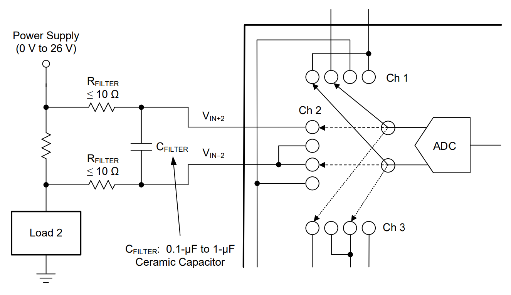

# STM32-INA3221
STM32 library for the Texas Instruments INA3221 I2C 3-Channel Power Monitor IC

## Usage Example
### Simple Code
```c++
#include "INA3221.hpp"

// Create INA3221 object with I2C interface and I2C address
INA3221 ina(&hi2c1, 0x40);

// Specify shunt resistance for each channel that you want to use
ina.set_shunt_resistance(INA3221_CHANNEL::CHANNEL_1, 10e-3);  // 10 mOhm shunt resistor for channel 1

// Simple loop to read bus voltage and offset corrected current
while(true)
{
  float bus_voltage = ina.get_bus_voltage(INA3221_CHANNEL::CHANNEL_1);
  float current = ina.get_current_corrected(INA3221_CHANNEL::CHANNEL_1);

  HAL_Delay(100);
}
```
### Build
Copy the `INA3221.cpp`, `INA3221.hpp`, `INA3221_reg.hpp`, `I2C.cpp` and `I2C.hpp` to your source and include directory.

To build, specify a build flag for your STM32 MCU. For a STM32F1XXX for example, use `-D STM32F1`.

In the **Cube IDE**, paste the flag in the `Preprocessor` tab in the C/C++ build settings under `Project > Properties`

## API
### Constructor
Construct an INA3221 sensor object using the hi2c interface and the I2C address (e.g. 0x40)
```c++
INA3221(I2C_HandleTypeDef *hi2c, uint8_t address)
```
---
### Set Shunt resistors
To specify the shunt resistors for each channel, use
```c++
void set_shunt_resistor(INA3221_CHANNEL channel, float resistance);
```
---
### Set Filter resistors
In some usecases, the INA current sense lines `IN+` and `IN-` are connected to an input filtering network consisting of two filter resitors and one filter capacitor.
If such a filter is used, it is necessary to specify the filter resistors. These values are used for current offset correction. 



Each channel filter resistance can be set independently. The default value is `0 Ohms`.
```c++
void set_filter_resistor(INA3221_CHANNEL channel, float resistance);
```
---
### Bus voltage
The bus voltage is the high side power supply voltage that is connected to the `IN+` pin of the given channel. The maximum allowed voltage is `26 V`. The measurement resolution is `8 mV`.
```c++
float INA3221::get_bus_voltage(INA3221_CHANNEL channel);
```
---
### Shunt voltage
The shunt voltage is the measured voltage drop across the shunt resistor. The shunt voltage resolution is `40 uV`.
```c++
float INA3221::get_shunt_voltage_raw(INA3221_CHANNEL channel);
```
The raw shunt voltage can have a relevant offset, especially if filter resistors are used or if the measured current is small. For offset corrected readings, use
```c++
float INA3221::get_shunt_voltage_corrected(INA3221_CHANNEL channel);
```
ℹ️ Getting the corrected shunt voltage takes slightly longer because the bus voltage is read for offset correction.

---
### Current
The current measurement is calculated using the shunt resistance and the measured shunt voltage. 
```c++
float INA3221::get_current_raw(INA3221_CHANNEL channel);
```
The raw current can have a relevant offset, especially if filter resistors are used or if the measured current is small. For offset corrected readings, use
```c++
float INA3221::get_current_corrected(INA3221_CHANNEL channel);
```

ℹ️ Getting the corrected current takes slightly longer because the bus voltage is read for offset correction.

---
